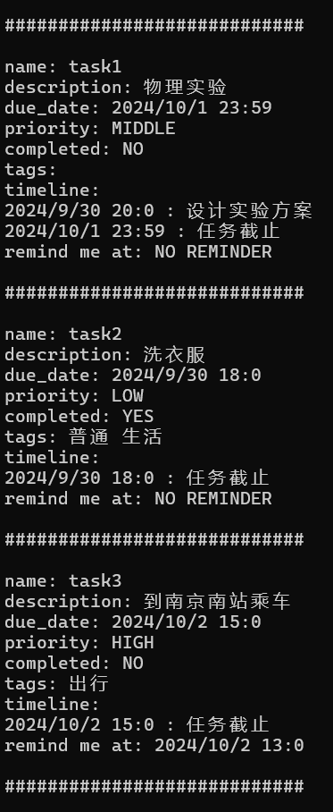
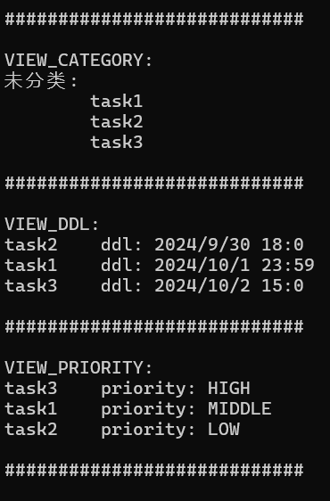

## 实验三报告

**221220157 李灿祥 468918993@qq.com**

### 一. 从uml图到代码

##### 1. 类图

代码的各个类的设计严格参考了类图。相较于实验2，我修改了类图的设计，新增了UserInterface类。UserInterface类提供了一系列用户接口，用户只能通过UserInterface类提供的接口进行操作，提高了封装性和数据安全性。

UserInterface类接口的实现依赖Task类，Category类，Statistics类，ViewMode类提供的接口，反映了类图中"use"的关系。


```
class Task {
	std::string name;
	std::string description;
	Date due_date;
	Priority priority;
	bool completed;
	std::vector<Tag> tags;
	Timeline timeline;
	Reminder* reminder = nullptr;
    '''
}
```
Task类依旧作为核心类，它的成员变量包含了TimeLine类，Tag类，Reminder类的对象或对象指针。这严格反映了类图中这些类之间的关系。

Statistics类计算完成率时使用Task类提供的接口；
ViewMode类对Task类进行展示，按照vt的不同，分为日历视图展示、按优先级排序展示、按ddl排序展示、按提醒时间排序展示、按分类展示；
Category类储存类别名和类别下的`vector<Task*>`。
这反映了它们各自与Task类的关系。

##### 2. 对象图

对象图作为某个运行时刻类图的反映，将它转化为代码很大程度取决于类图。在将对象图转化为代码时，采用了面向对象编程的思想。
我设计了四个全局变量：

```
std::vector<Task*> task_list;
Category category;
ViewMode viewmode;
Statistics statistics;
```
它们分别定义在各自的源文件里。
在main函数中，定义`UserInterface ui`,从而通过`ui`提供的接口对数据进行操作。未来也许可以定义多个`ui`并做相应修改，实现多用户和并发控制。

##### 3. 活动图

活动图中的所有用户操作都通过UserInterface类提供的接口实现。只要实现类中提供的接口即可，不赘述。

##### 4. 通信图

通信图反映了类之间的交互关系。以`UserInterface`类提供的`add_timeline_node2task`函数为例：

```
void UserInterface::add_timeline_node2task(std::string _name, int _year, int _month, int _day, int _hour, int _min, std::string desc) {
	int task_list_i = search_in_task_list(_name);
	Date date(_year, _month, _day, _hour, _min);
	task_list[task_list_i]->add_timeline_node(date, desc);
}
```

转到`Task`类中的`add_timeline_node`函数：

```
void Task::add_timeline_node(Date date, std::string desc) {
	timeline.add_timeline_node(date, desc);
}
```

再转到`Timeline`类的`add_timeline_node`函数：

```
void Timeline::add_timeline_node(Date date, std::string desc) {
	assert(date_list.size() > 0);
	int i = date_list.size() - 1;
	while (i >= 0 && date.earlier_than(date_list[i])) {
		i--;
	}
	date_list.insert(date_list.begin() + (i + 1), date);
	desc_list.insert(desc_list.begin() + (i + 1), desc);
}
```

将通信图转换为代码是通过类之间的交互实现的。类似的设计还有很多，不一一列举。

##### 5. 代码规模

源代码规模在600行以上。

##### 6. 大模型的使用

我没有直接让大模型将uml图转化为代码，代码中各个类都是我根据uml图独立设计的。

我在将uml图转化为代码时，询问了大模型关于C++对象构造与消亡过程、STL的使用、枚举类型的使用等问题，免去了另外查资料的过程，节省了很多时间。

如果大模型生成内容不符合预期，我会补充更详细的信息，或者重新描述问题并补充信息，再次向大模型提问。

### 二. 代码编译和运行结果展示

```cpp
// 构建task1
ui.new_task("task1", "物理实验", 2024, 10, 1, 23, 59, PRI_MIDDLE);
ui.add_timeline_node2task("task1", 2024, 9, 30, 20, 0, "设计实验方案");
// 构建task2 
ui.new_task("task2", "洗衣服", 2024, 9, 30, 18, 0, PRI_LOW);
ui.add_tag2task("task2", "普通");
ui.add_tag2task("task2", "生活");
ui.finish_task("task2");
// 构建task3
ui.new_task("task3", "到南京南站乘车", 2024, 10, 2, 15, 0, PRI_HIGH);
ui.add_tag2task("task3", "出行");
ui.add_reminder2task("task3", 2024, 10, 2, 13, 0);
// 展示构建结果
cout << endl << "############################" << endl << endl;
ui.show_all_details_of_task("task1");
cout << endl << "############################" << endl << endl;
ui.show_all_details_of_task("task2");
cout << endl << "############################" << endl << endl;
ui.show_all_details_of_task("task3");
cout << endl << "############################" << endl << endl;
```

运行结果：



```cpp
// 展示列表视图排序结果
ui.tasks_show_by_category();
cout << endl << "############################" << endl << endl;
ui.tasks_show_by_ddl();
cout << endl << "############################" << endl << endl;
ui.tasks_show_by_priority();
cout << endl << "############################" << endl << endl;
```

运行结果：



```cpp
// 展示统计功能
ui.show_completion_rate();
```

运行结果：


### 三. 远程代码管理展示

远程仓库地址：https://github.com/CxLnjucs/TaskListApp


